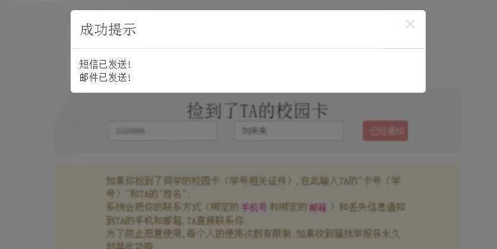
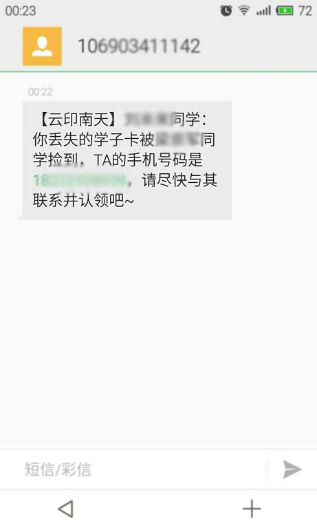
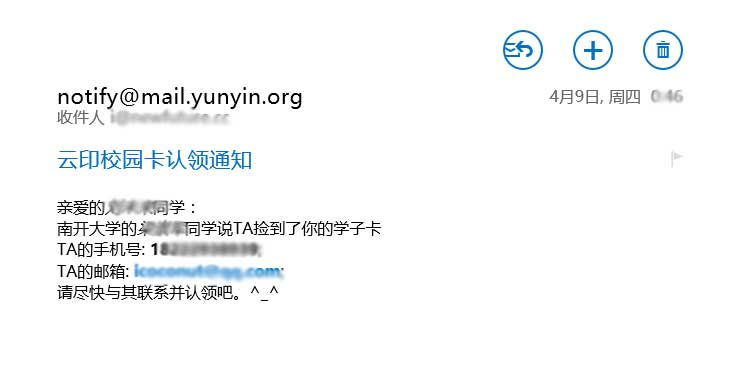
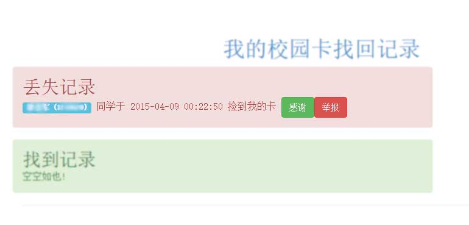

----

>这年头谁没丢过卡或者见到卡
>
>丢卡的人(`失主`)着急,捡到卡(`施主`)找丢卡的人也着急
>
>如果卡丢了，它能告诉我在哪儿那就好了！

于是我们设计了一个校园卡招领方案:

* **直接通知到本人**，不必在人人和盆友圈疯狂的转发
* 低成本，不需要什么智能芯片电子卡套（实际上完全**免费**完全**兼容**）
* 保证能离线收到信息（短信通知）

大概就是酱紫的：

## 下面是内测图
-----

### 1.找回中心

进入找回中心
 

### 2.通知失主

在找回界面输入`卡号`和`姓名`

平台会根据云印的数据库进行匹配和验证

然后把`施主`的信息通知给`失主`

### 3.失主会收到短信通知

短信通知失主丢卡信息，同时告诉TA`施主`的信息。

### 4.如果绑定了邮箱当然还有邮件

万一手机没电了或者手机也惨遭不幸，还有完整的邮件

把`施主`的完整的联系方式发送到`失主`的邮箱

### 5.管理记录

感谢还是骚扰在这里管理

### 6.目前数据还不够大，万一匹配失败了！

通过第三方失物招领平台（人人和微博）**立即**广播（如果你愿意）

-----

# 核心功能已经内测完成，恳求意见！！！
# 等待大家的完善！
# 可以直接在下面吐槽
----